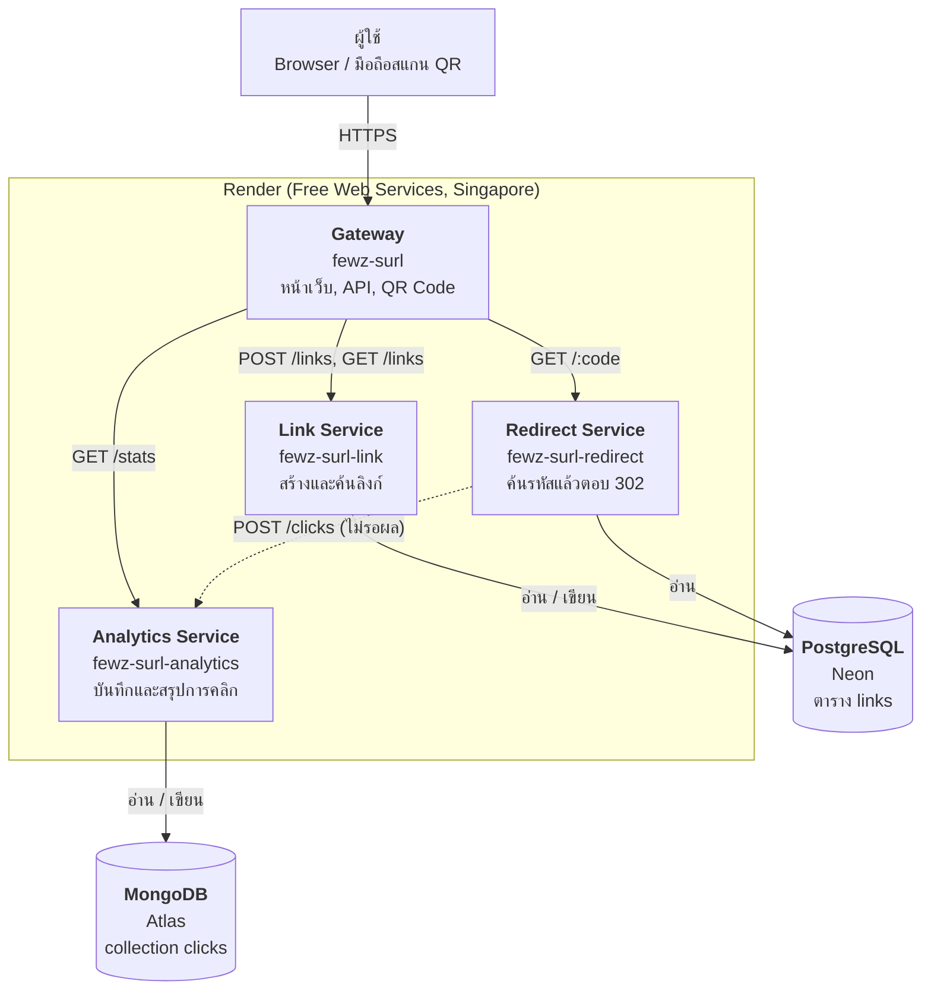
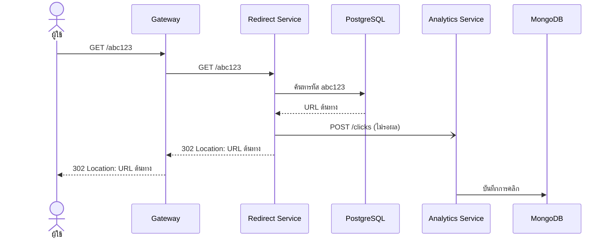
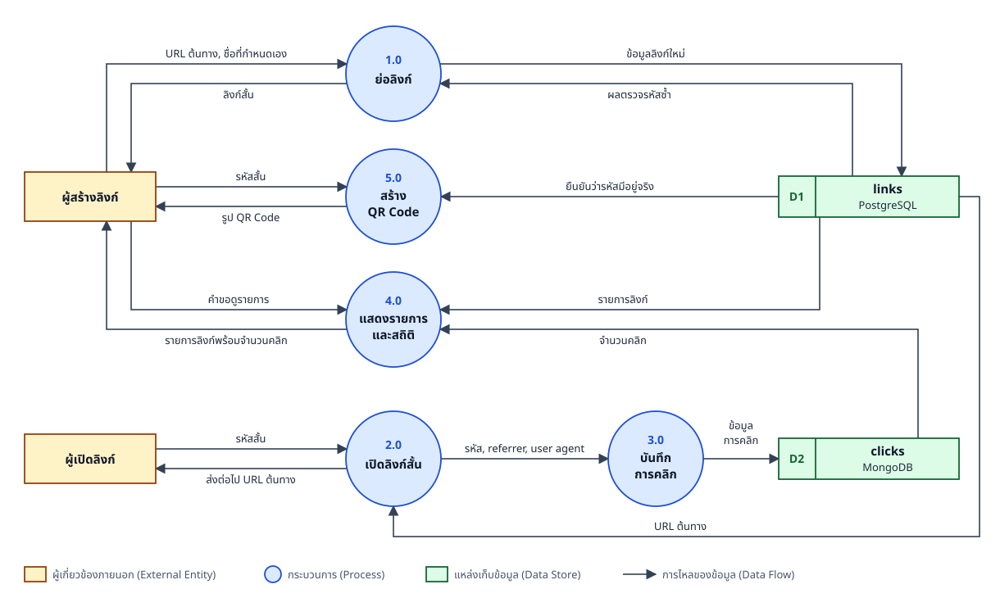
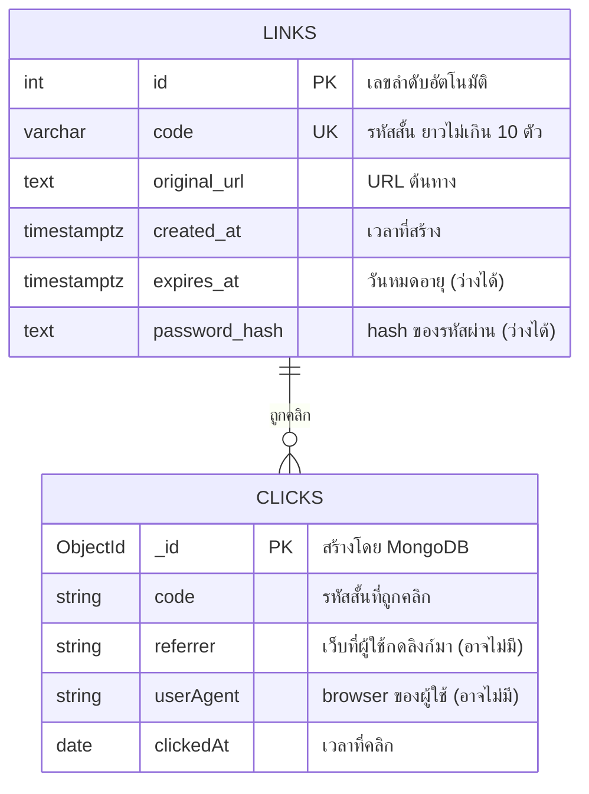

# Short URL

ระบบย่อลิงก์พร้อม QR Code และสถิติการคลิก พัฒนาด้วย **Node.js** (framework NestJS) ในรูปแบบ **Microservice** 4 ตัว เชื่อมต่อฐานข้อมูล **PostgreSQL** และ **MongoDB**

## ลิงก์ใช้งานจริง

**https://fewz-surl.onrender.com**

ระบบอยู่บน free host ซึ่งจะพัก service เมื่อไม่มีผู้ใช้ 15 นาที การเปิดครั้งแรกหลังพักอาจใช้เวลา 1–2 นาที และคอลัมน์ "คลิก" อาจแสดง `–` ชั่วครู่ระหว่างที่ service สถิติกำลังเริ่มทำงาน กด "รีเฟรช" อีกครั้งจะแสดงตัวเลข

## เทียบกับโจทย์

| ข้อกำหนด | สิ่งที่ทำ |
|---|---|
| พัฒนาด้วย NodeJS | ทุก service รันบน Node.js 24 ใช้ framework NestJS |
| เชื่อมต่อฐานข้อมูล MySQL, MSSQL, PostgreSQL หรือ MongoDB | PostgreSQL เก็บลิงก์ และ MongoDB เก็บประวัติการคลิก |
| เข้าผ่าน URL ได้ บน Free Host | https://fewz-surl.onrender.com (Render แบบ free) |
| ทำเป็น Microservice | 4 service แยกกัน deploy และเรียกกันผ่าน HTTP |
| Architecture Diagram | อยู่ในหัวข้อถัดไป |

## Architecture Diagram

### ภาพรวมระบบ



ผู้ใช้ติดต่อกับ Gateway เพียงจุดเดียว ส่วนอีก 3 service ทำงานอยู่ข้างหลัง

### ลำดับการทำงานเมื่อเปิดลิงก์สั้น



Redirect Service ส่งข้อมูลการคลิกให้ Analytics Service โดยไม่รอผล ผู้ใช้จึงถูกส่งไปยังปลายทางทันที และถ้า Analytics Service หรือ MongoDB ขัดข้อง ลิงก์สั้นยังใช้งานได้ตามปกติ

## Data Flow Diagram (DFD Level 0)

แสดงกระบวนการหลัก 5 กระบวนการ แหล่งเก็บข้อมูล 2 แหล่ง และข้อมูลที่ไหลระหว่างกัน



| กระบวนการ | Service ที่รับผิดชอบ |
|---|---|
| 1.0 ย่อลิงก์ | Gateway และ Link Service |
| 2.0 เปิดลิงก์สั้น | Gateway และ Redirect Service |
| 3.0 บันทึกการคลิก | Analytics Service |
| 4.0 แสดงรายการและสถิติ | Gateway, Link Service และ Analytics Service |
| 5.0 สร้าง QR Code | Gateway และ Link Service |

## ER Diagram



`LINKS` อยู่ใน PostgreSQL และ `CLICKS` อยู่ใน MongoDB ลิงก์หนึ่งรายการมีการคลิกได้ตั้งแต่ศูนย์ครั้งขึ้นไป ทั้งสองเชื่อมกันด้วยค่า `code` ความสัมพันธ์นี้เป็นความสัมพันธ์เชิงตรรกะ ไม่มี foreign key บังคับ เพราะข้อมูลอยู่คนละฐานข้อมูลตามหลักของ microservice

## Service ทั้ง 4 ตัว

| Service | โฟลเดอร์ | Port บนเครื่อง | URL บน Render | ฐานข้อมูล |
|---|---|---|---|---|
| Gateway | `apps/shorturl` | 3000 | https://fewz-surl.onrender.com | ไม่มี |
| Link Service | `apps/link-service` | 3001 | https://fewz-surl-link.onrender.com | PostgreSQL |
| Redirect Service | `apps/redirect-service` | 3002 | https://fewz-surl-redirect.onrender.com | PostgreSQL (อ่านอย่างเดียว) |
| Analytics Service | `apps/analytics-service` | 3003 | https://fewz-surl-analytics.onrender.com | MongoDB |

- **Gateway** เป็นจุดเข้าเดียวของระบบ ส่งหน้าเว็บ รับ request แล้วเรียก service ที่เกี่ยวข้อง รวมข้อมูลลิงก์กับจำนวนคลิกจาก 2 service เป็นคำตอบเดียว และสร้าง QR Code
- **Link Service** สร้างลิงก์สั้น ตรวจสอบ URL และชื่อที่กำหนดเอง และสุ่มรหัส 6 ตัวอักษรที่ไม่ซ้ำ
- **Redirect Service** ทำหน้าที่เดียวคือค้นรหัสแล้วตอบ 302 จึงทำงานเร็วและขยายแยกจากส่วนอื่นได้
- **Analytics Service** บันทึกการคลิกทุกครั้ง และสรุปจำนวนคลิกของแต่ละลิงก์

## ฐานข้อมูล

| | PostgreSQL (Neon) | MongoDB (Atlas) |
|---|---|---|
| เก็บอะไร | ลิงก์: รหัสสั้นคู่กับ URL ต้นทาง | ประวัติการคลิก: รหัส, เวลา, referrer, user agent |
| โครงสร้าง | ตาราง `links` (id, code, original_url, created_at) | collection `clicks` หนึ่งเอกสารต่อหนึ่งคลิก |
| เหตุผลที่เลือก | โครงสร้างตายตัว และบังคับให้รหัสห้ามซ้ำได้ในฐานข้อมูล | ข้อมูลแบบ log ที่เพิ่มขึ้นเรื่อยๆ บางช่องอาจไม่มีค่า และเพิ่มช่องใหม่ได้โดยไม่ต้องแก้โครงสร้าง |

แยกฐานข้อมูลตามหลักของ microservice ที่ให้แต่ละส่วนดูแลข้อมูลของตัวเอง ถ้า MongoDB ขัดข้อง การย่อลิงก์และการเปิดลิงก์สั้นยังทำงานได้ มีเพียงสถิติที่ใช้ไม่ได้ชั่วคราว

## ฟีเจอร์

- ย่อลิงก์เป็นรหัสสุ่ม 6 ตัวอักษร
- กำหนดชื่อลิงก์เองได้ (3–10 ตัวอักษร: a-z, A-Z, 0-9, `_`, `-`)
- สร้าง QR Code ของลิงก์สั้น ดาวน์โหลดเป็น PNG หรือ SVG ได้ การสแกน QR ถูกนับเป็นการคลิกด้วย
- ปรับแต่ง QR Code ได้: รูปร่างจุด (สี่เหลี่ยม มุมมน วงกลม), สีจุดและสีพื้นหลัง, กรอบพร้อมข้อความ ระบบตรวจว่าสีที่เลือกยังสแกนได้
- ตัวเลือกเสริม: กำหนดวันหมดอายุของลิงก์ เมื่อเลยเวลาแล้วจะเปิดไม่ได้
- ตัวเลือกเสริม: ตั้งรหัสผ่าน ผู้เปิดลิงก์ต้องกรอกรหัสให้ถูกก่อนจึงจะไปยัง URL ต้นทางได้
- แสดงรายการลิงก์ล่าสุดพร้อมจำนวนคลิก
- ธีมสว่างและมืด สลับได้ด้วยปุ่มมุมขวาบน และจำค่าที่เลือกไว้

## API ของ Gateway

| Method | Path | หน้าที่ |
|---|---|---|
| GET | `/` | หน้าเว็บ |
| POST | `/api/links` | สร้างลิงก์สั้น รับ JSON `{ "url", "alias", "expiresAt", "password" }` โดยบังคับเฉพาะ `url` |
| GET | `/api/links` | รายการลิงก์ล่าสุด 100 รายการ พร้อมจำนวนคลิก |
| GET | `/api/stats/:code` | จำนวนคลิกและ 20 คลิกล่าสุดของลิงก์ |
| GET | `/api/qr/:code` | QR Code แบบ SVG ปรับแต่งได้ด้วย `shape` (`square`, `rounded`, `dots`), `fg` และ `bg` (สีเลขฐานสิบหก 6 หลัก), `frame=1` และ `label` เพิ่ม `?format=png` เพื่อดาวน์โหลด PNG แบบพื้นฐาน |
| POST | `/api/unlock/:code` | ตรวจรหัสผ่านของลิงก์ รับ JSON `{ "password" }` ถ้าถูกคืน URL ต้นทาง |
| GET | `/:code` | ส่งต่อไปยัง URL ต้นทาง (302) ถ้าลิงก์ตั้งรหัสผ่านไว้จะแสดงหน้ากรอกรหัส (401) และถ้าหมดอายุจะแสดงหน้าแจ้งหมดอายุ (410) |

ตัวอย่างการสร้างลิงก์:

```bash
curl -X POST https://fewz-surl.onrender.com/api/links \
  -H "Content-Type: application/json" \
  -d '{"url":"https://www.example.com"}'
```

## ความปลอดภัย

| ความเสี่ยง | การป้องกัน |
|---|---|
| แทรกสคริปต์ในหน้าเว็บ (XSS) | Content-Security-Policy อนุญาตเฉพาะไฟล์สคริปต์และสไตล์จากโดเมนของระบบเอง สคริปต์ที่ถูกแทรกเข้ามาจะไม่ถูกรัน และหน้าเว็บแสดงข้อมูลจากผู้ใช้ด้วย `textContent` |
| ลิงก์อันตราย เช่น `javascript:` | รับเฉพาะ URL ที่ขึ้นต้นด้วย `http://` หรือ `https://` |
| ข้อมูลขนาดใหญ่เกิน | จำกัด URL ไม่เกิน 2048 ตัวอักษร |
| รหัสรูปแบบผิดปกติ | Gateway ตรวจรูปแบบรหัสก่อนส่งต่อ ถ้าไม่ตรงตอบ 404 ทันที |
| ใช้ระบบสร้าง QR ของข้อความอื่น | สร้าง QR ให้เฉพาะรหัสที่มีอยู่จริงในฐานข้อมูล |
| แทรกโค้ดผ่านค่าปรับแต่ง QR | รับสีเฉพาะเลขฐานสิบหก 6 หลัก รับรูปร่างเฉพาะค่าที่กำหนด และข้อความในกรอบถูก escape และจำกัด 24 ตัวอักษร ก่อนใส่ลงใน SVG |
| ปลอม Host header ให้ QR ชี้ไปโดเมนอื่น | ใช้โดเมนจากค่าตั้งค่าของ server เท่านั้น |
| SQL / NoSQL Injection | ใช้ TypeORM และ Mongoose ซึ่งส่งค่าแบบ parameter ไม่ต่อข้อความคำสั่งเอง |
| นำหน้าเว็บไปซ้อนในเว็บอื่น (Clickjacking) | header `X-Frame-Options: DENY` และ `frame-ancestors 'none'` |
| รหัสผ่านของลิงก์รั่ว | เก็บเป็น hash ด้วย scrypt พร้อม salt แบบสุ่ม ไม่เก็บรหัสจริง ไม่ส่ง hash ออกทาง API และไม่เปิดเผย URL ต้นทางของลิงก์ที่ตั้งรหัสผ่านจนกว่าจะกรอกรหัสถูก |
| รหัสผ่านฐานข้อมูลรั่ว | เก็บในตัวแปรสภาพแวดล้อม ไม่อยู่ใน repository |

## วิธีรันบนเครื่อง

ต้องมี Node.js 24, ฐานข้อมูล PostgreSQL และ MongoDB

1. ติดตั้ง library

   ```bash
   npm install
   ```

2. สร้างตารางใน PostgreSQL

   ```sql
   CREATE TABLE links (
     id           SERIAL PRIMARY KEY,
     code         VARCHAR(10) NOT NULL UNIQUE,
     original_url TEXT NOT NULL,
     created_at    TIMESTAMPTZ NOT NULL DEFAULT now(),
     expires_at    TIMESTAMPTZ,
     password_hash TEXT
   );
   ```

   MongoDB ไม่ต้องสร้างอะไรล่วงหน้า collection `clicks` จะถูกสร้างเมื่อมีการคลิกครั้งแรก

3. คัดลอก `.env.example` เป็น `.env` แล้วใส่ค่า `DATABASE_URL` และ `MONGODB_URI`

4. รันทั้ง 4 service คนละหน้าต่าง

   ```bash
   npx nest start shorturl --watch
   npx nest start link-service --watch
   npx nest start redirect-service --watch
   npx nest start analytics-service --watch
   ```

5. เปิด http://localhost:3000

## วิธี deploy

ไฟล์ [render.yaml](render.yaml) กำหนด service ทั้ง 4 ตัวไว้แล้ว

1. ที่ Render เลือก **New** → **Blueprint** แล้วเลือก repository นี้
2. กรอก `DATABASE_URL` ของ `fewz-surl-link` และ `fewz-surl-redirect` และ `MONGODB_URI` ของ `fewz-surl-analytics`
3. กด **Deploy Blueprint**

หลังจากนั้นทุกครั้งที่ push ขึ้น branch `master` Render จะ build และ deploy ใหม่ให้อัตโนมัติ เฉพาะ service ที่โค้ดเปลี่ยน

## เทคโนโลยีที่ใช้

| ส่วน | เทคโนโลยี |
|---|---|
| Runtime | Node.js 24 |
| Framework | NestJS 12 (TypeScript) |
| ฐานข้อมูล | PostgreSQL (Neon) ผ่าน TypeORM, MongoDB (Atlas) ผ่าน Mongoose |
| QR Code | library `qrcode` |
| หน้าเว็บ | HTML, CSS และ JavaScript ในโฟลเดอร์ `apps/shorturl/public` ไม่ใช้ framework ฝั่ง browser |
| Host | Render (Free Web Service) |

## ข้อจำกัดที่ทราบ

- **ไม่มีการจำกัดจำนวนการสร้างลิงก์ต่อผู้ใช้ (rate limit)** จึงอาจถูกส่งคำขอจำนวนมากได้
- **ไม่จำกัดจำนวนครั้งที่ลองรหัสผ่านของลิงก์** จึงเดารหัสซ้ำๆ ได้ รหัสผ่านที่สั้นหรือเดาง่ายจึงไม่ปลอดภัย
- **รายการลิงก์ในหน้าแรกเป็นของทุกคนรวมกัน** เพราะระบบไม่มีสมาชิก ลิงก์ที่ตั้งรหัสผ่านจะซ่อน URL ต้นทางไว้ แต่ยังเห็นว่ามีลิงก์นั้นอยู่
- **ลิงก์ที่หมดอายุยังอยู่ในฐานข้อมูล** เพียงแต่เปิดไม่ได้
- **ไม่ตรวจว่า URL ต้นทางเป็นเว็บอันตรายหรือไม่** การตรวจต้องใช้บริการภายนอก
- **Service ข้างหลังทั้ง 3 ตัวมี URL สาธารณะ** เพราะ service แบบ free ของ Render รับการเชื่อมต่อผ่านเครือข่ายภายในไม่ได้ ผู้ที่รู้ URL จึงเรียกได้โดยไม่ผ่าน Gateway
- **การคลิกในช่วงที่ Analytics Service หรือ MongoDB ขัดข้องจะไม่ถูกบันทึก** เพราะไม่มีระบบคิวสำหรับส่งซ้ำ
- **การเปิดครั้งแรกหลัง service พักใช้เวลา 1–2 นาที** ตามเงื่อนไขของ free host และ service ที่พักจะตื่นเฉพาะเมื่อถูกเรียกจากภายนอก Render คำขอจาก Gateway ปลุกไม่ได้ หน้าเว็บจึงเรียก service ข้างหลังจาก browser โดยตรงเพื่อปลุก แล้วลองใหม่เอง
